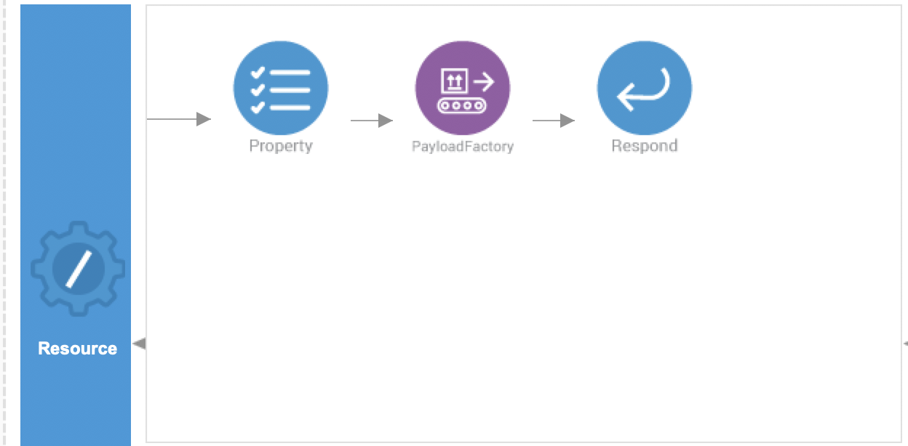
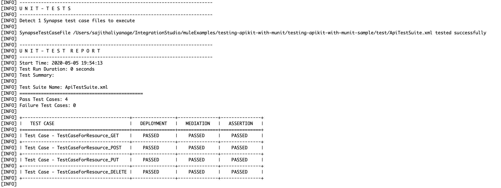

# Testing APIKit with MUnit

This tutorial demonstrates the process of creating unit tests to validate the behaviour of the APIs developed via the Integration Studio.

### Assumptions ###

This document assumes that you are familiar with WSO2 EI and the [Integration Studio interface](https://ei.docs.wso2.com/en/latest/micro-integrator/overview/quick-start-guide/). To increase your familiarity with Integration Studio, consider completing one or more [WSO2 EI Tutorials](https://ei.docs.wso2.com/en/latest/micro-integrator/use-cases/integration-use-cases/).

### Example Use Case

This example implementation route the request according the method which was used (GET, POST, PUT, DELETE) and generates dummy message, and a status code. Then we have written a test suite for this API to test the behaviour of each and every resource type in the API.

<p align="center">
  
</p>


### Set Up and Run the Example

Follow the steps in this procedure to create and run this example in your own instance of Integration Studio. 

1. Start WSO2 Integration Studio ([Installing WSO2 Integration Studio](https://ei.docs.wso2.com/en/latest/micro-integrator/develop/installing-WSO2-Integration-Studio/)).
2. In your menu in Studio, click the **File** menu. In the File menu select the **Import...** item.
3. In the Import window select the **Existing WSO2 Projects into workspace** under **WSO2** folder.
4. Browse and select the file path to the downloaded sample of this Github project 
(`integration-studio-examples/migration/mule/testing-apikit-with-munit`) and click **finish**.

**NOTE**<br/>
You have to use micro-integrator version 1.2.0 or higher to run this sample. 

### Creating Unit Tests
Once you have developed an integration solution, WSO2 Integration Studio allows you to build unit tests for the following:

- Test mediation sequences, proxy services, and REST apis with multiple test cases
- Test the artifacts with registry resources.
- Test the artifacts with Connectors.

You can follow the [Creating a Unit Test Suite](https://ei.docs.wso2.com/en/next/micro-integrator/develop/creating-unit-test-suite/) documentation to getting started with unit test suites for your integration solutions.

For this sample you can find the unit test suite code in the `test` directory located in the Integration project. Here we have used following two properties to assert the payload and the status code.
   -   `$body` - Assert the payload of the resource.
   -   `$statusCode` - Assert the status code of the resource.

- Unit Test Suite for api.xml.
    ```xml
    <unit-test>
        <artifacts>
            <test-artifact>
                <artifact>/testing-apikit-with-munit-sample/src/main/synapse-config/api/api.xml</artifact>
            </test-artifact>
            <supportive-artifacts/>
            <registry-resources/>
            <connector-resources/>
        </artifacts>
        <test-cases>
            <test-case name="TestCaseForResource_GET">
                <input>
                    <request-path>/unittests</request-path>
                    <request-method>GET</request-method>
                </input>
                <assertions>
                    <assertEquals>
                        <actual>$body</actual>
                        <expected><![CDATA[GET RESPONSE]]></expected>
                        <message>The response payload is not correct!</message>
                    </assertEquals>
                    <assertEquals>
                        <actual>$statusCode</actual>
                        <expected><![CDATA[200]]></expected>
                        <message>The HTTP Status code is not correct!</message>
                    </assertEquals>
                </assertions>
            </test-case>
            <test-case name="TestCaseForResource_POST">
                <input>
                    <request-path>/unittest</request-path>
                    <request-method>POST</request-method>
                </input>
                <assertions>
                    <assertEquals>
                        <actual>$body</actual>
                        <expected><![CDATA[POST RESPONSE]]></expected>
                        <message>The response payload is not correct!</message>
                    </assertEquals>
                    <assertEquals>
                        <actual>$statusCode</actual>
                        <expected><![CDATA[201]]></expected>
                        <message>The HTTP Status code is not correct!</message>
                    </assertEquals>
                </assertions>
            </test-case>
            <test-case name="TestCaseForResource_PUT">
                <input>
                    <request-path>/unittest</request-path>
                    <request-method>PUT</request-method>
                </input>
                <assertions>
                    <assertEquals>
                        <actual>$body</actual>
                        <expected><![CDATA[PUT RESPONSE]]></expected>
                        <message>The response payload is not correct!</message>
                    </assertEquals>
                    <assertEquals>
                        <actual>$statusCode</actual>
                        <expected><![CDATA[201]]></expected>
                        <message>The HTTP Status code is not correct!</message>
                    </assertEquals>
                </assertions>
            </test-case>
            <test-case name="TestCaseForResource_DELETE">
                <input>
                    <request-path>/unittest</request-path>
                    <request-method>DELETE</request-method>
                </input>
                <assertions>
                    <assertEquals>
                        <actual>$body</actual>
                        <expected><![CDATA[DELETE RESPONSE]]></expected>
                        <message>The response payload is not correct!</message>
                    </assertEquals>
                    <assertEquals>
                        <actual>$statusCode</actual>
                        <expected><![CDATA[200]]></expected>
                        <message>The HTTP Status code is not correct!</message>
                    </assertEquals>
                </assertions>
            </test-case>
        </test-cases>
        <mock-services/>
    </unit-test>
    ```

### Run Unit Test Suites

You can run the created Unit Test Suites using the unit testing server that is included in the embedded Micro Integrator of WSO2 Integration Studio. Right-click the test directory and click Run Unit Test to run all the unit test suites at once, or right-click the particular unit test suite and click Run Unit Test to run a selected unit test suite. Please refer the [Run Unit Test Suites](https://ei.docs.wso2.com/en/next/micro-integrator/develop/creating-unit-test-suite/#run-unit-test-suites) section to get more details.

Once you run the unit test suites, it will start the unit testing server in the console and prints the summary report for the given unit test suite(s) using the response from the unit testing server.




### Go Further

* Learn more about configuring an [REST API](https://ei.docs.wso2.com/en/latest/micro-integrator/references/synapse-properties/rest-api-properties/) in Studio.
* Learn more about creating [Unit Test Suites](https://ei.docs.wso2.com/en/next/micro-integrator/develop/creating-unit-test-suite/) in Studio.
* Learn more about creating [Mock Services for Unit Tests](https://ei.docs.wso2.com/en/next/micro-integrator/develop/creating-unit-test-suite/#create-mock-service) in Studio.
