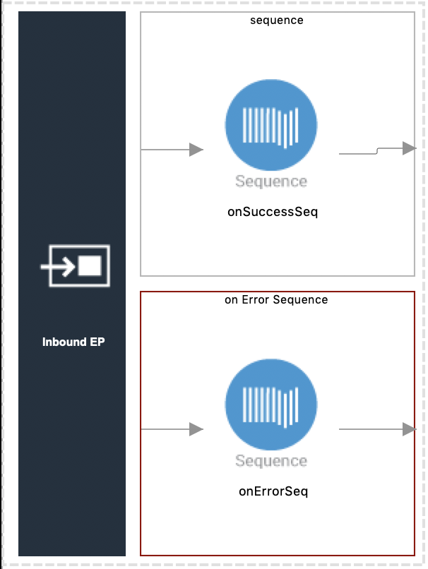

# Publish and then Consume a Topic in Apache Kafka

This example shows how to use two WSO2 EI connector for Apache Kafka (Apache Kafka Connector) operations, Publish and Consume, to publish a message to Apache Kafka and then retrieve it.

### Assumptions

This document describes the details of the example within the context of **WSO2 Integration Studio**, WSO2 EI’s graphical user interface (GUI). This document assumes that you are familiar with WSO2 EI and the [Integration Studio interface](https://ei.docs.wso2.com/en/latest/micro-integrator/develop/WSO2-Integration-Studio/). To increase your familiarity with Integration Studio, consider completing one or more [WSO2 EI Tutorials](https://ei.docs.wso2.com/en/latest/micro-integrator/use-cases/integration-use-cases/).

### Example Use Case

The example application has two key components. One to produce to a kafka Topic and another to consume from a topic.


### Set Up and Run the Example

1. Set up Apache Kafka on your machine.
    * For installation instructions, follow our [guide to set up Kafka](https://ei.docs.wso2.com/en/next/micro-integrator/references/connectors/kafka-connector/setting-up-kafka/)
    * Make sure to use the correct, compatible version of Kafka as mentioned in the guide. The current recommended version is [kafka_2.12-1.0.0](https://www.apache.org/dyn/closer.cgi?path=/kafka/1.0.0/kafka_2.12-1.0.0.tgz)
    
2. Set up the environment.
    * For installation instructions, follow our [guide to set up the environment](https://ei.docs.wso2.com/en/next/micro-integrator/references/connectors/kafka-connector/setting-up-kafka/#setting-up-the-environment)
    
3. Create a topic named **topic01** which will be used for this example.
    * Go to the Apache Kafka installation directory and run the following command to create the topic.
    ```
    bin/kafka-topics.sh --create --bootstrap-server localhost:9092 --replication-factor 1 --partitions 1 --topic topic01
    ```
    
4. Start WSO2 Integration Studio ([Installing WSO2 Integration Studio](https://ei.docs.wso2.com/en/latest/micro-integrator/develop/installing-WSO2-Integration-Studio/)).

5. In your menu in Studio, click the **File** menu. In the File menu select the **Import...** item.

6. In the Import window select the **Existing WSO2 Projects into workspace** under **WSO2** folder.

7. Browse and select the file path to the downloaded sample of this Github project (`integration-studio-examples/migration/mule/kafka-producer-consumer`) and click **Finish**.

8. Lets add the Kafka connector into the workspace. Right click on **KafkaProducerConsumer** and select **Add or Remove Connector**. In the **Add or Remove Connectors** window, select **Add connector** option and click **Next>**. Type `kafka` on the search bar of the WSO2 Connector Store. Click on download symbol and the Kafka connector will be downloaded form the store. Now click **Finish**.

9. Open the **KafkaProducerAPI.xml** under **kafka-producer-consumer/KafkaProducerConsumer/src/main/synapse-config/api** directory in the design view, click on the **Kafka init** connector and specify following values under the _Connector Parameters_ section of the Properties view. You can also provide these values in the source view. You can set many other Kafka relation connection parameters here as well. For a complete reference on service parameters, please follow the [official guide](https://ei.docs.wso2.com/en/next/micro-integrator/references/connectors/kafka-connector/kafka-connector-config/).
    * bootstrapServers: URL to your Kafka server. The default URL is set to _localhost:9092_
    
    
    
10. Open the **KafkaConsumerIEP.xml** under **kafka-producer-consumer/KafkaProducerConsumer/src/main/synapse-config/inbound-endpoint** directory in the design view, click on the **Inbound EP** and specify following values under the _Service Parameters_ section of the Properties view. You can also provide these values in the source view. You can provide many other service parameters here as well. Make sure to configure the environment to run the consumer by following the [official guide](https://ei.docs.wso2.com/en/next/micro-integrator/references/connectors/kafka-connector/kafka-inbound-endpoint-example/#deployment).
    * bootstrap.servers: URL to your Kafka server. The default URL is set to _localhost:9092_
    * topic.pattern: The pattern to identify topic names to subscribe
    * contentType: Content type of the incoming messages
    
    
    
11. Run the sample by right click on the **KafkaProducerConsumerCompositeApplication** under the main **kafka-producer-consumer** project and selecting **Export Project Artifacts and Run**.

12. Open HTTP Client in Integration Studio. Follow [HTTP Client Guidelines](../../../docs/common/adding-http-client-to-integration-studio.md) to open HTTP Client if the window is not visible in the interface.

13. Make a POST request to `http://localhost:8290/pushMessage` with the following payload body. Make sure to set the content type to _application/json_. The payload consists of the topic name which we need the message to be published and the message.
    ```
    {
    	"topic": "topic01",
    	"message": "This is a sample message"
    }
    ```
    
14. You will get the following response.
    ```
    Message successfully sent to Apache Kafka topic.
    ```
    
15. You can also see the following log message in the console which was printed when the message was consumed by the consumer inbound endpoint.
    ```
    New message arrived: This is a sample message, key: "1588749393939", partition: "0", offset: "13"
    ``` 

### How it works

When the payload arrives, the MI extracts the topic name and the message. Then it sets the current timestamp as the partition key and publish the message to Kafka. The consumer subscribes to all the topics which match the configured topic pattern. It consumes messages and prints a log entry.

<!-- INCLUDE_MD: ../../../docs/common/get-the-code.md -->

### Go Further

* Learn more about configuring an [Kafka Connector](https://ei.docs.wso2.com/en/next/micro-integrator/references/connectors/kafka-connector/kafka-connector-producer-example/) in Integration Studio.
* Learn more about [enabling security in Kafka connector](https://ei.docs.wso2.com/en/next/micro-integrator/references/connectors/kafka-connector/enabling-security-for-kafka/) in Integration Studio.
