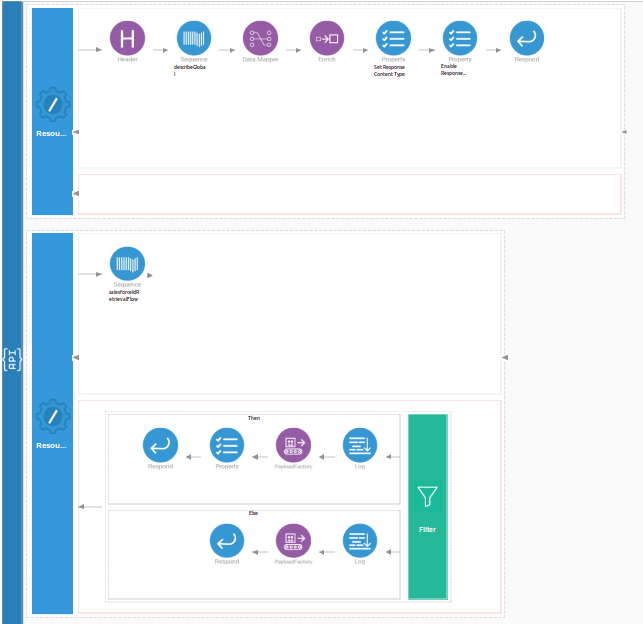
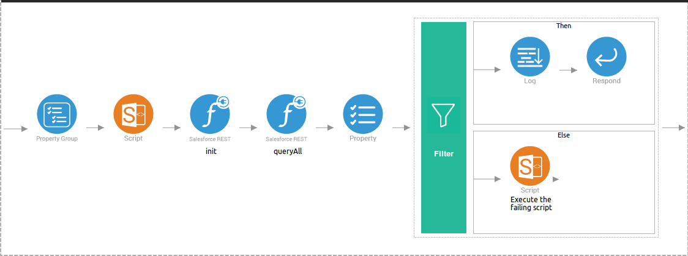

# Salesforce-data-retrieval example

This example explains how to use the Salesforce client to connect with the Salesforce instance and perform the data-retrieval operation from Salesforce.

## Assumptions

This document describes the details of the example within the context of WSO2 Integration Studio, editor to develop WSO2 EI artifacts. This document assumes that you are familiar with WSO2 EI and the [Integration Studio interface](https://ei.docs.wso2.com/en/latest/micro-integrator/develop/WSO2-Integration-Studio/). To increase your familiarity with Integration Studio, consider completing one or more [WSO2 EI Tutorials](https://ei.docs.wso2.com/en/latest/micro-integrator/use-cases/integration-use-cases/).

## Example Use Case

In this example we can perform the following two types of data data-retrieval operations. The endpoint containing predefined set of parameters that are extracted and used while building a Salesforce query. Then the application receives the response and provides it to the end user. The Salesforce data retrieval example application contains two flows which receive end user HTTP requests, process them and returns the result to the client.

* Invoke salesforce `describeGlobal` operation.
  
  To retrieve a list of the objects that are available in the system, we can use `salesforcerest.describeGlobal`. You can then get metadata for an **object** or **objects** created in the **Salesforce**.

* Execute a `salesforcerest.queryAll` operation to retrieve the `name`, `iD` and `fieldvalue` from existing selected `object`.

  The form will be provided to you, enter the specific values. In this example use the Salesforce Query to search stored Salesforce data for specific information which is created under `Objects`.

## Set Up and Run the Example

Follow the steps in this procedure to create and run this example in your own instance of Integration Studio. You can create template applications straight out of the box in Integration Studio and tweak the configurations of the use case-based templates to create your own customized applications in WSO2 Integrator.

1. Start WSO2 Integration Studio. See [Installing WSO2 Integration Studio](https://ei.docs.wso2.com/en/latest/micro-integrator/develop/installing-WSO2-Integration-Studio/) 
2. In your menu in Studio, click the File menu. In the File menu select the **Import...** item.
3. In the Import window select the **Existing WSO2 Projects into workspace** under **WSO2** folder.
4. Browse and select the file path to the downloaded sample of this github project (`salesforce-data-retrival` folder of the downloaded github repository)
5. Lets add the file connector into the workspace. Right click on the **salesforce-data-retrive** and select **Add or Remove Connector**. Keep the **Add connector** option selected and click **Next>**. Search for 'file' using the search bar and click the download button located at the bottom right corner of the file connector. Click **Finish**.
6. Similarly, add the Salesforce REST Connector to the workspace.
7. Follow these [steps](https://ei.docs.wso2.com/en/latest/micro-integrator/references/connectors/salesforce-rest-connector/sf-access-token-generation/) to generate the Access Tokens for Salesforce and obtain the Access Token, and Refresh Token.
8. Open the **salesforceIdRetrievalFlow.xml** and **describeGlobal.xml** under **salesforce-data-retrieval/salesforce-data-retrive/src/main/synapse-config/sequences** directory.
9. Add the property values into the `init` operation as shown bellow. Replace the `clientSecret`, `clientId`, `accessToken`, `refreshToken` with obtained values from step 7.
   
   **Initialize the connector**
   
   ```
   <salesforcerest.init>
           <accessToken>xxxxxx</accessToken>
           <apiVersion>v44.0</apiVersion>
           <hostName>https://login.salesforce.com</hostName>
           <refreshToken>xxxxxxxx</refreshToken>
           <clientSecret>xxxxxxxx</clientSecret>
           <clientId>xxxxxxx</clientId>
           <apiUrl>https://ap17.salesforce.com</apiUrl>
           <registryPath>connectors/SalesforceRest</registryPath>
   </salesforcerest.init>
   ```

10. Please find the following graphical view of the `salesforce-data-retrival` sample.  
    
    **salesforce-data-retrieval.xml**
    
    <p align="center">
          
    </p>
    
    **describeGlobal.xml**
        
    <p align="center">
          
    </p>
    
    **salesforceIdRetrievalFlow.xml**
            
    <p align="center">
          
    </p>
   
11. Run the sample by right clicking on the **salesforce-data-retrive** project and selecting **Run as -> Run On Micro Integrator**.

12. Invok the create `salesforce-data-retrieval` API as shown below. 
    Open your browser and hit `http://localhost:8290/listener/`.The form will be provided to you, containing following values:
    
    <p align="center">
      
    </p>
    
      * Object - specify Salesforce object type, e.g. User, Account, Contact, etc.
      * Field - a valid field name for the given object you need. e.g BillingState
      * Search Key - a valid field name for the given object you wil use for matching, e.g. Name for BillingState.
      * Search Value - a value for the Search Key field that will be used for matching, e.g. FL

13. Click **Submit** button.

14. You will see the retrieved data as shown bellow.
    ```
    {"QueryResult":{"done":true,"records":[{"@type":"Account","@url":"/services/data/v44.0/sobjects/Account/0012x000004A8yNAAS","Id":"0012x000004A8yNAAS","Name":"WSO2","BillingState":"FL"},{"@type":"Account","@url":"/services/data/v44.0/sobjects/Account/0012x000004A8xWAAS","Id":"0012x000004A8xWAAS","Name":"WSO2","BillingState":"FL"},{"@type":"Account","@url":"/services/data/v44.0/sobjects/Account/0012x000004A9lwAAC","Id":"0012x000004A9lwAAC","Name":"WSO2","BillingState":"FL"}],"totalSize":3}}
    ```
15. In case of invalid input, the message shown as bellow.
    
    ```
    {"Error":"Invalid Salesforce query."}
    ```    
### Go Further 

* Learn more about [Salesforce REST connector](https://ei.docs.wso2.com/en/next/micro-integrator/references/connectors/salesforce-rest-connector/sf-rest-connector-example/).
* Read more on [WSO2 connectors](https://ei.docs.wso2.com/en/next/micro-integrator/references/connectors/connectors-overview/)    